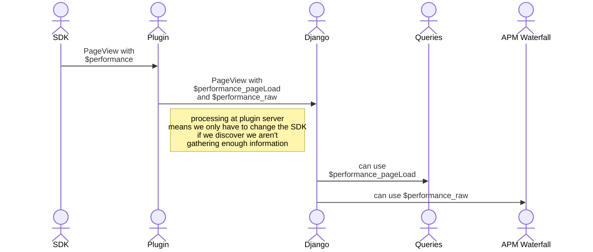

# PostHog APM Plugin

When the PostHog JS SDK has the capture performance config active it sends the browser's performance timings in the `$performance` field for `$pageview` events

This plugin processes that raw data into useful performance information

# Why a plugin?

The processing is done here rather than in the SDK so that new transformations and extractions can be added without needing to release a new version of the SDK

# References 

Many thanks to https://nicj.net/navigationtiming-in-practice/ and https://nicj.net/resourcetiming-in-practice/ for excellent context in how to use browser performance information
